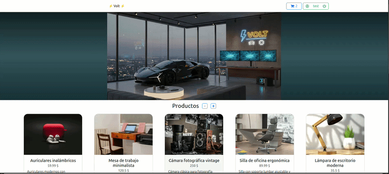

# 🛍 CommerseApi

Aplicación frontend desarrollada con React y Vite que consume la API ApiCommerce.

El proyecto implementa un flujo completo de e-commerce básico con autenticación, listado de productos y carrito de compras.

---

## Demo

## 🌐 Deploy

Proyecto desplegado en Netlify:

https://voltproyect.netlify.app/

---

## 🚀 Características

- Registro de usuario
- Login con almacenamiento de token
- Listado de productos desde API externa
- Agregar productos al carrito
- Eliminar productos del carrito
- Protección de rutas privadas
- Persistencia de sesión mediante token

---

## 🧱 Tecnologías utilizadas

- React
- Vite
- Axios
- Bootstrap
- React Bootstrap

---

## 🔗 Conexión con backend

Este proyecto consume la API:

https://github.com/XRukazuX/ApiCommerce

Toda la autenticación se maneja mediante JWT.

El token se almacena en el cliente y se envía en cada petición protegida.

---

## 🧠 Arquitectura

- Componentes reutilizables
- Manejo de estado con hooks
- Peticiones HTTP con Axios
- Separación entre vistas públicas y privadas

---

## 🎯 Objetivo del proyecto

Este proyecto fue desarrollado para demostrar:

- Consumo de API REST
- Manejo de autenticación en frontend
- Integración completa frontend + backend
- Flujo básico de e-commerce
- Deploy en Netlify

---

📌 Consideraciones técnicas

El sistema de autenticación no implementa verificación de correo electrónico ni confirmación vía email.
El campo email se utiliza únicamente como identificador dentro de la base de datos.

No se envían correos reales ni se integró un servicio externo de mailing, ya que el objetivo del proyecto es demostrar:

Implementación de autenticación con JWT

Protección de rutas

Manejo de usuarios en MongoDB

Al tratarse de un proyecto de práctica, no se consideró necesario integrar validación real de correo electrónico.

---

## 👨‍💻 Autor

Desarrollado por Lucas(XRukazuX)

Proyecto educativo / portfolio.

Ruta de Proyecto en Github:

https://github.com/XRukazuX/CommerseApi
